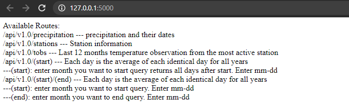
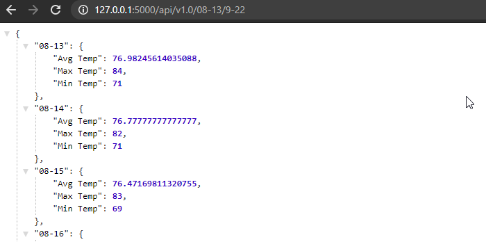

## Table of Contents
- [Introduction](#introduction)
- [Precipitation](#precipitation)
- [Temperatures](#temperatures)
  * [All Year](#temperature-over-the-corse-of-the-year)
  * [January 1st to April 30th](#temperature-from-january-1st-to-april-30th)
  * [June 1st to November 1st](#temperature-from-june-1st-to-november-1st)
- [Flask app](#flask-app)
- [How to use](#how-to-use)
- [Contact Me](#contact-me)

## Introduction
Analysis of climate in Honolulu, Hawaii climate over a year to determine when is the best time to visit for a vacation. Data used is a sqlite file from various stations in Hawaii from January 2010 through August 2017. Python's library, SQLalchemy, is used to read and filter through the data, Pandas library is used to analyze the data, and matplotlib is used to visualize the analysis.

## Precipitation
The precipitation over time for one year from the most active measurement station can be seen in the image below. Here, we can see several 'windows' of time where there is either low or no precipitation.

## Temperatures
Here all years available is averaged for every day of the year to get a good idea how the temperature for Hawaii looks on average each day throughout the year. First temperature chart is the entire year to view the overall trend of the seasons. Other charts are shorter ranges for easier viewing.  The jupyter notebook has a function "weather_for_trip" allowing you to select a specific date range to retrun a pandas dataframe of average temperatures over the selected range.
### Temperature over the corse of the year

### Temperature from January 1st to April 30th

### Temperature from June 1st to November 1st

## Flask app
A flask app (app.py) is used to construct an API using the sqlite file. The app can currently be run locally, but is designed to function as live API. It can be used to get JSON dictionary objects for precipitation and max/avg/min temperatures for each day on Hawaii. Below, you can see the different options included and an example of it's functionality.

## How to use
If you wish look further into this work, download the my_work folder to get all code and resources used. Required python libraries include matplotlib.pyplot, numpy, pandas, scipy.stats, datetime, and sqlalchemy. To use the flask app, Flask is also required, and you must execute the app.py file in python termianl with all of the neccessary libraries. While in the same directory as app.py, use command "$ python app.py".

## Contact me
Email: git@jakegeiser.us

