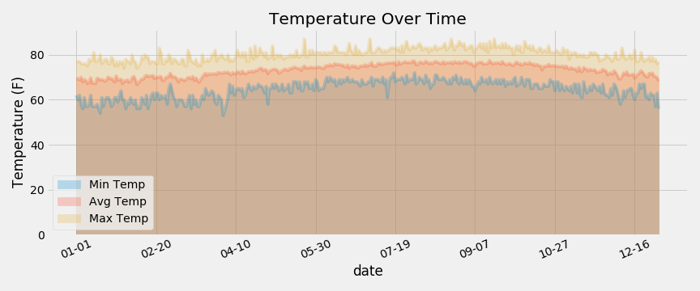

- [Hawaii-Climate-sqlalchemy](#hawaii-climate-sqlalchemy)
  * [Precipitation](#precipitation)
  * [Temperatures](#temperatures)
    + [Temperature over the corse of the year](#temperature-over-the-corse-of-the-year)
    + [Temperature from January 1st to April 30th](#temperature-from-january-1st-to-april-30th)
    + [Temperature from June 1st to November 1st](#temperature-from-june-1st-to-november-1st)

<small><i><a href='http://ecotrust-canada.github.io/markdown-toc/'>Table of contents generated with markdown-toc</a></i></small>

# Hawaii-Climate-sqlalchemy
Analysis of climate in Honolulu, Hawaii climate over a year to determine when is the best time to visit for a vacation. Data used is a sqlite file from various stations in Hawaii from September 2016 through August 2017. Python's library, SQLalchemy, is used to read and filter through the data, Pandas library is used to analyze the data, and matplotlib is used to visualize the analysis.

## Precipitation
The precipitation over time can be seen in the image below. Here, we can see several 'windows' of time where there is either low or no precipitation.

## Temperatures
First temperature chart is the entire year of data available. Other charts are shorter ranges for easier viewing.
### Temperature over the corse of the year

### Temperature from January 1st to April 30th

### Temperature from June 1st to November 1st

